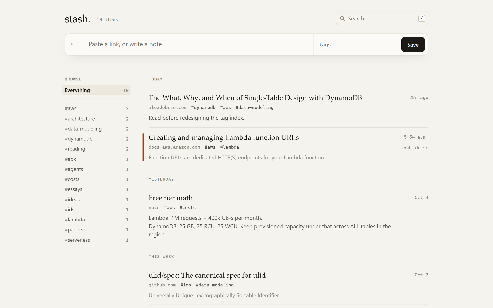

# stash

[](https://github.com/alex-wang55/stash/actions/workflows/tests.yml)

A personal place for links and notes: paste a URL, it fetches the title for you, you tag it, and you find it later. It runs on one AWS Lambda function and one DynamoDB table, chosen so it fits inside AWS's always-free tier.

<picture>
  <source media="(prefers-color-scheme: dark)" srcset="docs/screenshot-dark.png">
  
</picture>

The optional add-on is an AI agent built with Google's Agent Development Kit (ADK). It runs in a Docker container on Lambda and answers questions like "what did I save about DynamoDB last month?" by searching your stash.

```
 browser / curl / bookmarklet
          │  HTTPS (Lambda Function URL, no API Gateway)
          ▼
 ┌──────────────────────────┐        ┌──────────────────────┐
 │ stash Lambda (Python)    │◄──────►│ DynamoDB (1 table,   │
 │  GET /        web app    │        │ provisioned 10/10)   │
 │  /api/...     JSON API   │        └──────────────────────┘
 └──────────────────────────┘
          ▲  same API, same key
          │
 ┌──────────────────────────┐        ┌──────────────────────┐
 │ stash-agent Lambda       │───────►│ Gemini API           │
 │ (container image, ADK)   │        └──────────────────────┘
 │  POST /ask               │
 └──────────────────────────┘   optional add-on, separate stack
```

## What it does

- **Save in one step.** Paste a link and press Enter. The server fetches the page title and description, strips site-name clutter like "- Wikipedia", and drops descriptions that only repeat the title. Anything that isn't a link is saved as a note.
- **Tags with autocomplete.** Counts are shown in the sidebar, and clicking a tag filters the list.
- **Search** across titles, notes, URLs, descriptions and tags. Every word must match, and matches are highlighted.
- **Grouped by date:** Today, Yesterday, This week, then by month.
- **Edit in place, delete with confirmation.** Concurrent edits are detected rather than silently overwritten.
- **Keyboard-first:** `/` search, `n` new, `j`/`k` move, `o` open, `e` edit, `x x` delete, `?` for help.
- **Bookmarklet:** save the page you're on from any site, with its title already filled in.
- **Light and dark mode, and mobile layouts.** The page is a single HTML file served by the same Lambda, with no build step and no third-party requests.

## Cost: why this is $0

| Piece | Always-free allowance | What stash uses |
|---|---|---|
| Lambda | 1M requests + 400,000 GB-seconds per month | 256 MB, ~50–300 ms per request |
| Lambda Function URL | No charge beyond Lambda itself | Replaces API Gateway |
| DynamoDB | 25 GB storage, 25 RCU + 25 WCU provisioned | 10 RCU / 10 WCU by default |
| CloudWatch Logs | 5 GB ingestion | 14-day retention |
| Data transfer out | 100 GB per month | Pages and JSON sent to your browser (preview fetches are inbound, which is free) |

Deliberate choices to stay free:

- **The table uses provisioned capacity, not on-demand,** because the free tier is measured in provisioned units. The 25-unit limit is shared by every table in the region, so the template defaults to 10 and lets you change it.
- **There's no API Gateway, S3, CloudFront, NAT gateway or Secrets Manager.** The web app is served by the Lambda itself.
- **There's an optional zero-spend alarm.** Pass `BudgetEmail` and AWS Budgets emails you the moment the account spends a cent.

Two caveats:

- **Account plan.** New AWS accounts start on the Free plan, which closes after 6 months or when its credits run out. To keep running after that, upgrade to the Paid plan. The always-free allowances still apply there.
- **Public URL.** The Function URL is public. Requests without the key are rejected, but each one still counts as a Lambda invocation. A million a month are free.

**The agent is not strictly free.** Its container image lives in ECR, which has no always-free storage. Expect about $0.10 per GB per month, so pennies with the included two-image lifecycle policy. Gemini API calls are billed by Google, which has a free tier with rate limits. Check its current terms.

## Run it locally

You don't need an AWS account for this. The dev server runs the real Lambda handler, with DynamoDB mocked in memory by moto.

Use **Python 3.13**, the same version as the Lambda runtime. Python 3.14 evaluates type annotations lazily, which can hide errors that only crash at import time on Lambda.

```bash
python3.13 -m venv .venv
.venv/Scripts/activate        # macOS/Linux: source .venv/bin/activate
pip install -r requirements-dev.txt
python scripts/dev.py --seed
```

Open http://localhost:8787 and unlock it with the dev key the server prints. Data lives only as long as the process.

Run the tests:

```bash
pytest
```

GitHub Actions runs the same suite and lints both templates on Python 3.13 for every push and pull request ([workflow](.github/workflows/tests.yml)).

The agent tests need `pip install -r agent/requirements.txt` and are skipped otherwise. They run the real ADK runner, the real tools and the real stash API end to end, with only the LLM replaced by a scripted fake, so they need no API key.

> **Windows note:** if `pip install` fails with "filename or extension is too long", your project path is too deep for botocore's data files. Put the virtualenv at a short path, e.g. `python -m venv C:\venvs\stash`.

## Deploy

You need an AWS account, the [AWS CLI](https://docs.aws.amazon.com/cli/latest/userguide/getting-started-install.html) (configured with `aws configure`), and the [SAM CLI](https://docs.aws.amazon.com/serverless-application-model/latest/developerguide/install-sam-cli.html).

```bash
python -c "import secrets; print(secrets.token_urlsafe(32))"   # your ApiKey; keep it somewhere safe
sam build
sam deploy --guided
```

`--guided` asks for a stack name (use `stash`), a region and the parameters. The region matters: the free-tier capacity is per region. When it finishes, open the `StashUrl` output, enter your key, and drag the bookmarklet (in the footer) to your bookmarks bar.

Later deploys are just `sam build && sam deploy`. `--guided` saves your answers, including the key, to `samconfig.toml`. That file is in `.gitignore`, so keep it out of version control.

### Use the API directly

```bash
export STASH=https://<id>.lambda-url.<region>.on.aws
export KEY=<your api key>

curl -s -X POST $STASH/api/items -H "authorization: Bearer $KEY" -H "content-type: application/json" \
  -d '{"url": "https://www.alexdebrie.com/posts/dynamodb-single-table/", "tags": ["dynamodb"], "note": "read before redesigning"}'

curl -s "$STASH/api/items?tag=dynamodb&q=single+table" -H "authorization: Bearer $KEY"
```

| Method | Path | Notes |
|---|---|---|
| `GET` | `/api/items` | `q`, `tag`, `since`/`until` (ISO dates), `limit` (≤100), `cursor` |
| `POST` | `/api/items` | `{url?, note?, title?, tags?}`. Needs a url or a note. The title is fetched if omitted. |
| `GET` | `/api/items/{id}` | |
| `PATCH` | `/api/items/{id}` | Any of `url`, `title`, `note`, `tags`. Returns 409 if someone else edited it first. |
| `DELETE` | `/api/items/{id}` | |
| `GET` | `/api/tags` | `{total, tags: [{tag, count}]}` |

Auth is `Authorization: Bearer <key>` (or `x-api-key`). `GET /` serves the web app, and `GET /api/health` needs no key.

## The agent (stretch goal)

[`agent/`](agent/) is a Google ADK agent with four tools over the stash API: `search_stash`, `list_tags`, `get_item` and `save_link`. Saving happens only when you explicitly ask. It ships as a Lambda **container image** with its own Function URL. Once connected, the web app's search box gets an **Ask** mode.

**Try it locally first.** You need a [Gemini API key](https://aistudio.google.com/apikey).

```bash
pip install -r agent/requirements.txt
GOOGLE_API_KEY=... python scripts/dev.py --seed --agent      # PowerShell: $env:GOOGLE_API_KEY="..."; python scripts/dev.py --seed --agent
```

**Deploy it.** This needs Docker running and the stash stack already deployed.

```bash
cd agent
aws ecr create-repository --repository-name stash-agent
aws ecr put-lifecycle-policy --repository-name stash-agent --lifecycle-policy-text file://ecr-lifecycle.json
sam build
sam deploy --guided --stack-name stash-agent --image-repository <repositoryUri from create-repository>
```

Give it the stash's `StashUrl`, the same `ApiKey` and your `GoogleApiKey`. Then connect the two by redeploying the stash stack and pasting the agent's `AgentUrl` output when it asks:

```bash
cd ..
sam build
sam deploy --guided
```

The web app now shows **Search | Ask**. The agent's Function URL only accepts browser calls from your stash's origin (CORS), and every call needs the key. A cold start takes several seconds while ADK imports; warm calls are bounded by the model.

## Data model

There is one DynamoDB table with a string partition key `pk` and sort key `sk`:

| pk | sk | holds |
|---|---|---|
| `ITEM` | `<ulid>` | the item itself |
| `TAG#<tag>` | `<ulid>` | one link row per tag the item has |
| `TAGS` | `<tag>` | running count of items with that tag |
| `META` | `stats` | running total of items |

- **Item IDs are [ULIDs](https://github.com/ulid/spec), which sort by time.** So "newest first" is a reverse key-order Query, and "saved between X and Y" is a key-range condition, with no scans and no secondary indexes.
- **A tag filter is a Query on `TAG#x`** followed by a BatchGetItem.
- **Every write that touches several rows is a single `TransactWriteItems`.** That covers the item, its tag links, the tag counters and the total, so counts can't drift.
- **Edits carry a version number,** and a stale edit fails with 409 instead of clobbering a newer one.

Trade-offs worth knowing:

- **Free-text search filters in the Lambda,** so it reads (and spends capacity on) every row it inspects. Each request is capped at 1,000 rows and the cursor continues from there. That's fine for a personal stash of thousands of items. Past that, you'd add a search index or an inverted-index table.
- **The table has `DeletionPolicy: Retain`.** Deleting the stack keeps your data. Delete the table yourself if you mean it.
- **The API key is a Lambda environment variable,** so anyone with console access to the function can read it. That's fine for a personal project. Secrets Manager costs $0.40 a month, which would break the $0 goal.
- **There's no reserved concurrency cap.** Lambda requires part of the account's concurrency to stay unreserved, and new accounts often start with a very low limit, so a reservation in the template would make the deploy fail there. If your account limit is higher, consider capping it.

## Link previews and SSRF

Fetching arbitrary URLs from a server is a classic server-side request forgery (SSRF) risk. The preview fetcher ([`src/stash/meta.py`](src/stash/meta.py)) defends against it as follows:

- It resolves the host first and refuses anything that isn't a public address: loopback, private ranges, link-local (including `169.254.169.254`) and IPv4-mapped IPv6.
- It re-checks every redirect hop.
- It reads at most 512 KB, caps decompressed output at the same size (no zip bombs), and times out after 4 seconds.
- It never fails the save. A failed preview just means no title.

## Project layout

```
template.yaml          SAM: table, function, Function URL, permissions, optional budget
src/stash/app.py       Lambda handler: routing, auth, responses
src/stash/store.py     DynamoDB access (single-table design above)
src/stash/meta.py      link previews + SSRF guard
src/stash/model.py     validation and normalisation
src/stash/web/         the whole web app (one HTML file)
scripts/dev.py         local server with mocked DynamoDB (+ --agent)
tests/                 API, store and unit tests (moto)
agent/                 ADK agent: tools, Lambda handler, Dockerfile, its own SAM template
```

## Tear down

```bash
sam delete --stack-name stash-agent      # if you deployed it
aws ecr delete-repository --repository-name stash-agent --force
sam delete --stack-name stash
aws dynamodb delete-table --table-name <TableName output>   # only if you want the data gone
```
